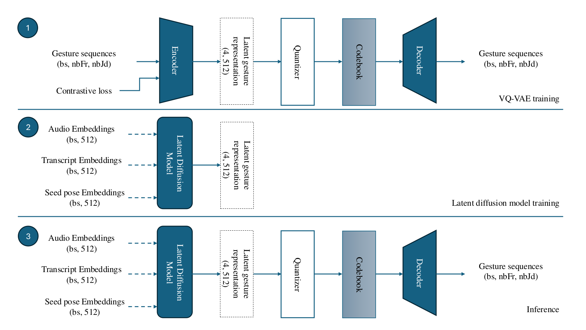
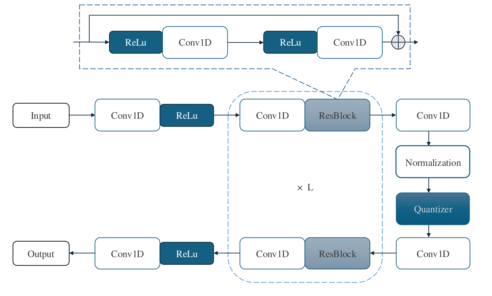
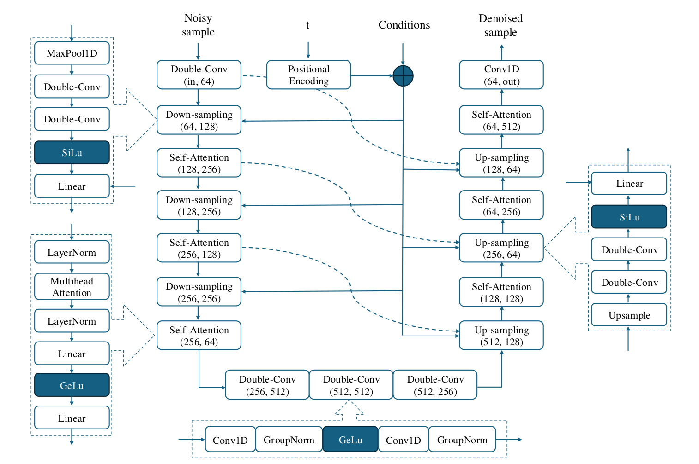

# **Latent Diffusion Model with Contrastive learning for Co-speech Gesture Generation**

This repository contains the implementation of a gesture generation system based on VQ-VAE and Latent Diffusion models, developed as part of the master's thesis titled *[Co-Speech Gesture Generation with Non-Deterministic Deep Learning Methods](https://studenttheses.uu.nl/handle/20.500.12932/47429)*. The project aims to generate realistic, diverse, and semantically aligned gestures based on input speech and text using non-deterministic deep learning methods, with a particular focus on diffusion models.

<div align="center">
    
</div>

---

## **Table of Contents**
- [Project Overview](#project-overview)
- [Project Structure](#project-structure)
- [Installation](#installation)
- [Datasets](#datasets)
- [Usage](#usage)
  - [Training Hand and Body Parts Separately](#training-hand-and-body-parts-separately)
  - [Training the Models](#training-the-models)
  - [Evaluation](#evaluation)
  - [Generating Gesture Videos](#generating-gesture-videos)
- [Models and Methods](#models-and-methods)
  - [VQ-VAE](#vq-vae)
  - [Diffusion Model](#diffusion-model)
  - [Contrastive Learning](#contrastive-learning)
- [Data Loading and Preprocessing](#data-loading-and-preprocessing)
- [Evaluation Metrics](#evaluation-metrics)
- [Contributing](#contributing)
- [License](#license)

---

## **Project Overview**

In this research, we explore the use of contrastive learning to extract the underlying semantic alignment between the transcript and audio of speeches and the corresponding gestures. Given the idiosyncratic nature of gestures, we integrate the speaker's identity into the contrastive learning process to learn the speaker-specific gesture style, rather than directly feeding the speaker's identity as an input to the model.

Additionally, we experiment with non-deterministic approaches, specifically diffusion models, which have demonstrated promising results in other generative domains such as image, video, mesh, and motion generation. By leveraging these models, the project aims to generate realistic, diverse, and semantically aligned gestures based on input speech and text, while accounting for individual speaker characteristics.


---

## **Project Structure**
    |-- configs/ # YAML file for configurations stores here
    |-- data/ # Save the datasets here
        |-- aqgt/
            |-- train/
            |-- test/
            |-- val/
        |-- Ted-Expressive/
            |-- train/
            |-- test/
            |-- val/
        |-- checkpoint_best.bin # Pre-trained autoencoder for the Ted-Expressive dataset
        |-- gesture_autoencoder_checkpoint_best.bin # Pre-trained autoencoder for the AQGT dataset
    |-- output/ # Saved experiments and model checkpoints 
    |-- scripts/
        |-- data_loader/ # Data loading and preprocessing scripts 
        |-- models/ # Contains models such as VQ-VAE and Diffusion models 
        |-- utils/ # Helper functions (e.g., for option parsing, logging) 
        |-- analyze_code_indices.py # Script to analyze extracted codebook indices
        |-- check_code_indices.py # Script to extract the codebook indices are used in the training
        |-- data_analysis.py # Script to analyze the datasets
        |-- diffusion_lightning_trainer.py # Script to train the Diffusion model 
        |-- evaluate_models.py # Script to evaluate models 
        |-- generate_video.py # Script to generate gesture videos from models 
        |-- vqvae_lightning_trainer.py # Script to train the VQ-VAE model 
    |-- aqgt_means.p # Mean direction vectors of the AQGT dataset
    |-- expressive_means.p # Mean direction vectors of the Ted-Expressive dataset
    |-- README.md # Project documentation


---

## **Installation**

1. **Clone the repository**:
   ```bash
   git clone https://github.com/sohiyel/LDMC-Gesture-Generator.git
   cd LDMC-Gesture-Generator
2. **Create a virtual environment**:

    ```bash
    python -m venv venv
    source venv/bin/activate  # Linux/Mac
    # or
    venv\Scripts\activate  # Windows
3. **Install dependencies**:

    ```bash
    pip install -r requirements.txt
4. **Optional: Install GPU-specific dependencies**:

    ```bash
    pip install torch torchvision torchaudio --index-url https://download.pytorch.org/whl/cu118  # Adjust for your CUDA version
## Datasets
The project primarily uses the TED Expressive and AQGT datasets:

### **TED Expressive**: 

Contains upper body joint direction vectors, including arms and fingers. It provides synchronized speech, transcripts, and 3D gesture data for over 1,700 TED talks.

For downloading this dataset and pre-trained autoencoder, please refer to [DiffGesture](https://github.com/Advocate99/DiffGesture) repository.
### AQGT: 

Provides full-body gesture sequences extracted using pose estimation algorithms. It includes diverse speakers from different languages and cultures.

For downloading this dataset and pre-trained autoencoder, please refer to [AQGT](https://github.com/hvoss-techfak/AQGT) repository.


## **Usage**
### Training the Models
#### Training Hand and Body Parts Separately
Due to the differences in data distribution between the hand and other body parts, the training process for generating gestures is separated. Hand movements are typically more subtle and have a different dynamic range and distribution compared to larger body movements (e.g., torso, arms). By training separate models for hand and body parts, we can capture the nuances of each motion type more effectively, allowing the models to learn distinct features for hand gestures and larger body movements.

**Hand Training**: 

Focuses on fine-grained movements, such as finger motions and smaller-scale gestures.

**Body Training**: 

Focuses on larger movements involving the torso, arms, and head.
The models are then combined during the generation process to create a full-body gesture sequence that is semantically aligned with speech and text input.

1. **Train the VQ-VAE model**:

    ```bash
    python vqvae_lightning_trainer.py --config config/vq-vae-2-aqgt-body.yaml # For training a vqvae model for the body part on the AQGT dataset
    python vqvae_lightning_trainer.py --config config/vq-vae-2-aqgt-hand.yaml # For training a vqvae model for the hand part on the AQGT dataset
    python vqvae_lightning_trainer.py --config config/vq-vae-2-exp-body.yaml # For training a vqvae model for the body part on the TED-Expressive dataset
    python vqvae_lightning_trainer.py --config config/vq-vae-2-exp-hand.yaml # For training a vqvae model for the hand part on the TED=Expressive dataset
2. **Train the Diffusion model**:

    ```bash
    python diffusion_lightning_trainer.py --config config/diffusion-aqgt-body.yaml # For training a diffusion model for the body part on the AQGT dataset
    python diffusion_lightning_trainer.py --config config/diffusion-aqgt-hand.yaml # For training a diffusion model for the hand part on the AQGT dataset
    python diffusion_lightning_trainer.py --config config/diffusion-exp-body.yaml # For training a diffusion model for the body part on the TED-Expressive dataset
    python diffusion_lightning_trainer.py --config config/diffusion-exp-hand.yaml # For training a diffusion model for the hand part on the TED-Expressive dataset

### Evaluation:
    python evaluate_models.py --config config/eval-aqgt.yaml # For running an evaluation on the AQGT dataset
    python evaluate_models.py --config config/exp-exp.yaml # For running an evaluation on the TED-Expressive dataset


### **Generating Gesture Videos**:
To generate gesture videos based on speech input:

    python generate_video.py --config config/eval-aqgt.yaml # For generating videos from the AQGT dataset
    python generate_video.py --config config/eval-exp.yaml # For generating videos from the TED-Expressive dataset
The script generates videos showing human-like gestures generated by the model.

## **Models and Methods**
### **VQ-VAE**
<div align="center">
    
</div>
The VQ-VAE (Vector Quantized Variational Autoencoder) is used to encode input gestures into discrete latent variables and reconstruct them. This model learns a compact representation of the gesture sequences in a latent space and is conditioned on audio and text embeddings.

    - Input: Audio and text embeddings, seed gesture sequences.
    - Output: Discrete latent representations of gestures.
### **Diffusion Model**
<div align="center">
    
</div>
The Diffusion model is trained to progressively generate gesture sequences from Gaussian noise. It incorporates the VQ-VAE latent representations and generates semantically aligned gestures.

    - Input: Latent representations of gestures (generated from text/audio embeddings).
    - Output: Semantically aligned gesture sequences.

### Contrastive Learning
Contrastive learning is used to align the gesture representations with the audio, text, and style embeddings. The idea is to learn similarity between positive pairs (e.g., gestures from the same speaker) and dissimilarity with negative pairs (e.g., gestures from different speakers).

## Data Loading and Preprocessing
The data loading process is handled by custom scripts in the data_loader/ directory. The data is preprocessed by converting speech and transcript information into latent embeddings using the pre-trained Data2Vec model. Preprocessing steps include:

**Audio and Text Embeddings**: 

Using pre-trained Data2Vec models.
Pose Sequences: Normalizing joint directions and segmenting gesture sequences into short frames.

## Evaluation Metrics
The following metrics are used to evaluate the generated gestures:

### Frechet Gesture Distance (FGD): 
Measures the similarity between the distributions of real and generated gestures.
### Diversity Score: 
Evaluates how diverse the generated gestures are.

Subjective evaluation is also performed to assess human-likeness and semantic relevance of the generated gestures.

## Contributing
We welcome contributions! If you'd like to contribute, please fork the repository and submit a pull request with your changes. You can also report issues or suggest features via GitHub issues.

## License
This project is licensed under the MIT License. See the LICENSE file for more details.
We borrowed some scripts from the [DiffGesture](https://github.com/Advocate99/DiffGesture), [AQGT](https://github.com/hvoss-techfak/AQGT), [T2M-GPT](https://github.com/Mael-zys/T2M-GPT), and [Diffusion-Models-pytorch](https://github.com/dome272/Diffusion-Models-pytorch).